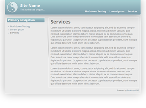

Aeon5
=====

A simple, minimalistic, responsive theme with Color module support.

Installation
------------

- Install this theme using the official Backdrop CMS instructions at
  https://backdropcms.org/guide/themes

- Settings for page width and color scheme /admin/appearance/settings/aeon5.

License
-------

This project is GPL v2 software. See the LICENSE.txt file in this directory for
complete text.

Current Maintainers
-------------------

- Chris Herberte (https://github.com/chrisherberte)
- Jen Lampton (https://github.com/jenlampton)
